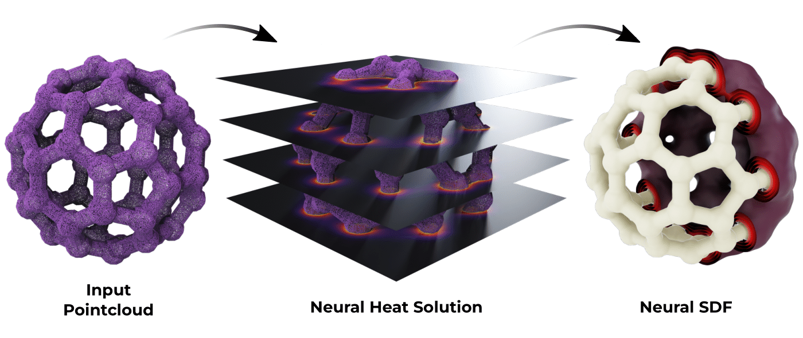

# HeatSDF

This repository contains the official code for the paper:

**"SDFs from Unoriented Point Clouds using Neural Variational Heat Distances"**  
📄 [Paper](https://doi.org/10.1111/cgf.70296)

---

## 🔥 Overview

**HeatSDF** is a neural framework that reconstructs Signed Distance Functions (SDFs) from **unoriented point clouds** using a novel variational approach based on heat distances.

## 🧠 Abstract

We propose a novel variational approach for computing neural Signed Distance Fields (SDF) from unoriented point clouds. To this end, we replace the commonly used eikonal equation with the heat method, carrying over to the neural domain what has long been standard practice for computing distances on discrete surfaces. This yields two convex optimization problems for whose solution we employ neural networks: We first compute a neural approximation of the gradients of the unsigned distance field through a small time step of heat flow with weighted point cloud densities as initial data. Then we use it to compute a neural approximation of the SDF. We prove that the underlying variational problems are well-posed. Through numerical experiments, we demonstrate that our method provides state-of-the-art surface reconstruction and consistent SDF gradients. Furthermore, we show in a proof-of-concept that it is accurate enough for solving a PDE on the zero-level set.

---

## 🛠 Installation
This repository provides a Anaconda environment, and requires NVIDIA GPU to run the optimization routine. The code is tested with the following main dependencies: cudatoolkit 11.0, pytorch 1.7.1, torchaudio 0.7.2, torchvision 0.8.2, scikit-learn 1.3.2, trimesh 4.5.3, ubuntu 20.04. 
The whole environment can be set-up using the following commands:

```bash
conda env create -f HeatSDF_env.yml
conda activate HeatSDF
```
## 🚀 Usage
To run the complete learning pipeline for both the heat method and SDF reconstruction, execute the following command:
```
python run_HeatSDF.py
```
This will start the training process, performing both the heat learning stage (to estimate gradient directions of the unsigned distance field) and the SDF learning stage (to reconstruct the signed distance function).

If you want to test the method on your own point clouds, simply modify the input paths in the relevant configuration file located in the config folder.

The config file allows you to adjust various settings, including data paths and hyperparameters. Especially, if you are only interested in an approximation of the SDF near the surface, use 
```
input.parameters.sampling: boxes
```
for faster computation.
The results are saved in `/HeatSDF/logs/SDF<current_date>`, with the heat and SDF steps organized into their respective subfolders: `/HeatSDF/logs/SDF<current_date>/heat_step` and `/HeatSDF/logs/SDF<current_date>/SDF_step`.

In addition, we provide a variant of the method that uses generalized winding numbers for inside/outside separation. To run this version, follow these steps:
1.) Set up a new Anaconda environment (requires cudatoolkit 12.9 and PyTorch 2.5.1)
```bash
conda env create -f HeatSDF_Winding.yml
conda activate HeatSDF_Winding
```
Then additionally install
```
pip install torch-geometric
pip install torch-scatter -f https://data.pyg.org/whl/torch-2.5.1+cu121.html
pip install torch-sparse  -f https://data.pyg.org/whl/torch-2.5.1+cu121.html
pip install torch-cluster -f https://data.pyg.org/whl/torch-2.5.1+cu121.html
```
Especially, this environment includes libigl 2.5.1. Newer versions of libigl do not include the required function "fast_winding_number_for_points".
2.) Clone the required third-party repository by Metzer, et. al.:
```bash
cd /HeatSDF/
mkdir third_party
cd thirdparty
git clone https://github.com/galmetzer/dipole-normal-prop.git
```
or alternativly clone the forked version
```bash
cd /HeatSDF/
mkdir third_party
cd third_party
git clone https://github.com/sweidemaier/dipole-normal-prop.git
```
3.) If you cloned the original version by Metzer, apply the following modifications to the cloned repository:

**File:** `.../third_party/dipole-normal-prop/utils.py`
```
time.clock() -> time.perf_counter()
torch.arange(n)[mask] -> torch.arange(n, device=mask.device)[mask]
e, v = torch.symeig(cov, eigenvectors=True) -> e, v = torch.linalg.eigh(cov, UPLO='L')
```

**File:** `.../third_party/dipole-normal-prop/inference_utils.py`
```
e, v = torch.symeig(cov, eigenvectors=True) -> e, v = torch.linalg.eigh(cov, UPLO='L')
```

**File:** `.../third_party/dipole-normal-prop/field_utils.py`
```
min_index = np.array([curv[i][0] for i in range(len(all_patches))]) -> min_index = np.array([curv[i][0].cpu().numpy() for i in range(len(all_patches))])
```
4.) Run HeatSDF with winding-number-based inside/outside segmentation:

```
python run_Winding_HeatSDF.py
```


---
## ✍️ Citation
If you use this code or ideas from the paper, please cite:
``` bibtex
@article{HeatSDF,
author = {Weidemaier, Samuel and Hartwig, Florine and Sassen, Josua and Conti, Sergio and Ben-Chen, Mirela and Rumpf, Martin},
title = {SDFs from Unoriented Point Clouds using Neural Variational Heat Distances},
journal = {Computer Graphics Forum},
pages = {e70296},
doi = {https://doi.org/10.1111/cgf.70296},
url = {https://onlinelibrary.wiley.com/doi/abs/10.1111/cgf.70296},
}


```
Questions or suggestions? Reach out at weidemai@ins.uni-bonn.de


